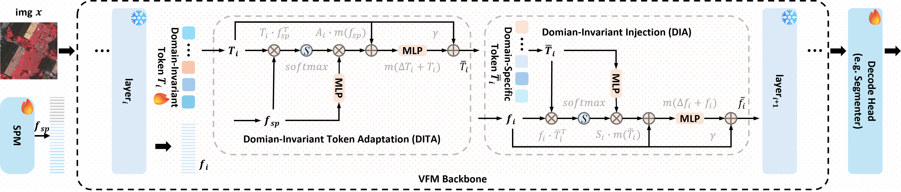

<div align="center">

<h2 style="border-bottom: 1px solid lightgray;">
Bridge: Leveraging Vision Foundation Models for Efficient Cross-Domain
Remote Sensing Segmentation
</h2>

<div style="display: flex; align-items: center; justify-content: center;">
<p align="center">
  <br align="center">
    <a href='#'></a>
    
    
    
    
    </br>
    
    
    
    
</p>
</div>
<br/>

<div style="display: flex; align-items: center; justify-content: center;"> Network Overview </div>

</div>


### 🔍️🔍️ NEWS

- [2026/02/02]  🥰🥰  The `Training Code` has been updated.
- [2025/09/21] ✨✨  The `README.md` has been updated.
- [2025/09/19] ✨✨ The [arxiv] paper will coming soon。


### 📄📄 TODO


- ❎ submit to arxiv
- ❎ upload **Bridge** model weights


## Clone Repo

---
We add [mmsegmentation](https://github.com/open-mmlab/mmsegmentation) as our repository 
[submodule](https://git-scm.com/book/en/v2/Git-Tools-Submodules) .

So, one should clone this repository use the script as follows:

<details>
<summary>clone repository</summary>

```shell
git clone --recurse-submodules https://github.com/woldier/Bridge


```
> ### Tips
> If one already cloned the project and forgot --recurse-submodules,
> 
> ```shell
>  # cloned the project and forgot clone submodules 🥲🥲
>  git clone https://github.com/woldier/Bridge 
> 
>  # initialize and update each submodule in the repository 🥰🥰
>  git submodule update --init
>  ```
> 

</details>


after that, we link `submodule-mmseg/mmseg` $\to$ `mmseg`:

<details>
<summary>soft link</summary>

```shell
ln -s submodule-mmseg/mmseg mmseg
```
</details>


## 🛠️ 1. Creating Virtual Environment

---

This repo use `python-3.8`, for `nvcc -v` with `cuda >= 11.6`.

`torch 2.1.1`, `cuda 12.1`, `mmcv 2.1.0`, `mmengine 0.9.1`

<details>
<summary>Install script</summary>


```shell
conda create -n  peft-mmpretrain  python==3.8 -y
conda activate peft-mmpretrain


pip install torch==2.1.2+cu121  torchvision==0.16.2+cu121 -f https://download.pytorch.org/whl/torch_stable.html
# for CN user use follow script
pip install torch==2.1.2+cu121  torchvision==0.16.2+cu121 -f https://mirrors.aliyun.com/pytorch-wheels/cu121/  

pip install mmcv==2.1.0 mmengine==0.9.1 -f https://download.openmmlab.com/mmcv/dist/cu121/torch2.1/index.html

pip install -r submodule-mmseg/requirements/runtime.txt
```
</details>

Installation of the reference document refer:

Torch and torchvision versions relationship.

[](https://github.com/pytorch/vision#installation)
[](https://blog.csdn.net/shiwanghualuo/article/details/122860521)


## 📂 2.Preparation of data sets

---
We selected Postsdam, Vaihingen and LoveDA as benchmark datasets and created train, val, test lists for researchers.

### 2.1 Download of datasets

### ISPRS Potsdam

The [Potsdam](https://www2.isprs.org/commissions/comm2/wg4/benchmark/2d-sem-label-potsdam/)
dataset is for urban semantic segmentation used in the 2D Semantic Labeling Contest - Potsdam.

The dataset can be requested at the challenge [homepage](https://www2.isprs.org/commissions/comm2/wg4/benchmark/data-request-form/).
The '2_Ortho_RGB.zip' and '5_Labels_all_noBoundary.zip' are required.


### ISPRS Vaihingen


The [Vaihingen](https://www2.isprs.org/commissions/comm2/wg4/benchmark/2d-sem-label-vaihingen/)
dataset is for urban semantic segmentation used in the 2D Semantic Labeling Contest - Vaihingen.

The dataset can be requested at the challenge [homepage](https://www2.isprs.org/commissions/comm2/wg4/benchmark/data-request-form/).
The 'ISPRS_semantic_labeling_Vaihingen.zip' and 'ISPRS_semantic_labeling_Vaihingen_ground_truth_eroded_COMPLETE.zip' are required.


#### LoveDA

The data could be downloaded from Google Drive [here](https://drive.google.com/drive/folders/1ibYV0qwn4yuuh068Rnc-w4tPi0U0c-ti?usp=sharing).

Or it can be downloaded from [zenodo](https://zenodo.org/record/5706578#.YZvN7SYRXdF), you should run the following command:

<details>
<summary> loveda download</summary>

```shell

cd /{your_project_base_path}/Bridge/data/LoveDA

# Download Train.zip
wget https://zenodo.org/record/5706578/files/Train.zip
# Download Val.zip
wget https://zenodo.org/record/5706578/files/Val.zip
# Download Test.zip
wget https://zenodo.org/record/5706578/files/Test.zip
```
</details>


### 2.2 Data set preprocessing
Place the downloaded file in the corresponding path
The format is as follows:

<details>
<summary>file</summary>

```text
Bridge/
├── data/
│   ├── LoveDA/
│   │   ├── Test.zip
│   │   ├── Train.zip
│   │   └── Val.zip
├── ├── Potsdam_RGB/
│   │   ├── 2_Ortho_RGB.zip
│   │   └── 5_Labels_all_noBoundary.zip
├── ├── Vaihingen_IRRG/
│   │   ├── ISPRS_semantic_labeling_Vaihingen.zip
│   │   └── ISPRS_semantic_labeling_Vaihingen_ground_truth_eroded_COMPLETE.zip
```

</details>


after that we can convert dataset:

<details>
<summary>details</summary>

- Potsdam
```shell
python tools/convert_datasets/potsdam.py data/Potsdam_RGB/ --clip_size 512 --stride_size 512 -o data/potsdam_RGB
```
- Vaihingen
```shell
python tools/convert_datasets/vaihingen.py data/Vaihingen_IRRG/ --clip_size 512 --stride_size 256 -o data/vaihingen
```


- LoveDA
```shell
python tools/convert_datasets/loveda.py data/LoveDA/ --tmp_dir data -o data/loveda
```

</details>


## 🧰 3. Preparation of pretraining weights

---

### 3.1 Download

Download pre-trained weights from [facebookresearch](https://dl.fbaipublicfiles.com/dinov2/dinov2_vitl14/dinov2_vitl14_pretrain.pth). 

Place them in the project directory without changing the file name.

### 3.2 Convert

<details>
<summary>model convert</summary>

```bash
python tools/convert_models/convert_dinov2.py pretrained/dinov2_vitl14_pretrain.pth pretrained/vit-large-p16_dinov2_converted.pth
```

</details>

> Alternatively, you can download the converted weights via the **link[Coming soon]**.


## 🔥 4. Training

---

<details>
<summary>training scripts</summary>

```bash
# pr2vi
python tools/train.py configs/bridge/bridge_segmentor_vit-l-p16_dinov2_pr2vi_20k.py

# vi2pr
python tools/train.py configs/bridge/bridge_segmentor_vit-l-p16_dinov2_vi2pr_20k.py

# r2u
python tools/train.py configs/bridge/bridgev2_segmentor_vit-l-p16_dinov2_r2u_20k.py
```
</details>


# 🫂 Acknowledgments

---

Many thanks to their excellent works
* [MMSegmentation](https://github.com/open-mmlab/mmsegmentation)
* [DACS](https://github.com/vikolss/DACS)
* [DAFormer](https://github.com/lhoyer/DAFormer)
* [SiamSeg](https://github.com/woldier/SiamSeg/)
* [Earth-Adapter](https://github.com/VisionXLab/Earth-Adapter)
